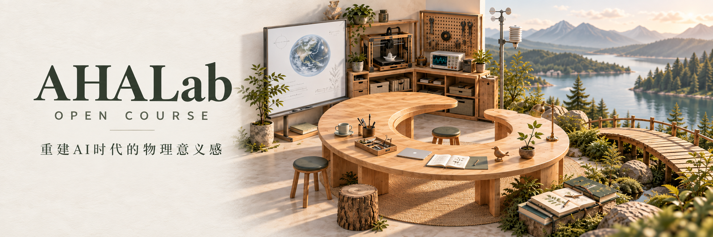

# AHALab Open Course

**Rebuilding a sense of physical meaning in the age of AI.**

[简体中文](README.md) · [Courses](https://aha-lab.ai/) · [Attribution](ATTRIBUTION.md)

AHALab explores AI and project-based learning through collaboration, care for others, and connections with the physical world. Observe, investigate, build, compare and revisit a question.

| Course | Available material |
|---|---|
| [MMCOOL: We share one world](courses/world-and-society/mmcool-worldview/README.md) | A two-day course design; this repository indexes the published Day 1 slides, teacher notes and activities on the course website. |
| [Cool Island](courses/climate-and-ecology/cool-island/README.md) | Six planned 120-minute sessions and a locally runnable browser activity. Weather examples are illustrative, not live forecasts. |
| [HTML presentation player](tools/html-ppt-player/README.md) | Three-slide example, speaker window, notes, timers and motion controls. |
| [From spaces to games](courses/spatial-world/spatial-workflows/README.md) | Three learning modules with editable source: an interactive room, a four-storey workshop and public-data reconstruction. |

Teaching materials are currently in Simplified Chinese. English summaries do not imply a full English translation. Use catalog.json for language availability and stable course paths.

Original course content uses CC BY 4.0; software and code use MIT. Preserve applicable credits and licenses. Third-party rights remain separate; reuse does not imply AHALab endorsement. See [license scope](LICENSE.md).

## From spaces to games: companion code

| Example | Start here |
|---|---|
| [One room, one task](courses/spatial-world/spatial-workflows/code/world-starter/README.md) | Blender → GLB → Three.js, collection, a campfire and optional AI |
| [Explorer Hall](courses/spatial-world/spatial-workflows/code/aha-world/README.md) | An independent four-level building, exploration, building and guest multiplayer |
| [Public-space reconstruction](courses/spatial-world/spatial-workflows/code/office-reconstruction/README.md) | Calibrated office1a photos, mesh repair, camera-matched comparison and animation |

[Course and downloads](https://aha-lab.ai/en/course/ai-game-studio/#source-code). The open-source hall is a separate example; [AHA Small World](https://world.aha-lab.ai/) remains the original game. Instructions are primarily in Chinese. See each README for requirements, limitations and third-party terms.

## Fork and contribute

[Fork this repository](https://github.com/AHALabAI/open-course/fork) to adapt a course or a tool. Retain the applicable notices and describe your changes. Submit corrections through a Pull Request or [Issue](https://github.com/AHALabAI/open-course/issues). A Star or Fork is optional and never a condition of the license.

## Editable classroom games

[Draw a maze, care for animals](courses/ai-and-computing/game-making/README.en.md): a first-person 3D maze with a rectangular map editor, and a 2D animal-care game. Both run locally. English setup instructions and an activity plan are included; the game interfaces and detailed teaching notes are in Simplified Chinese.
