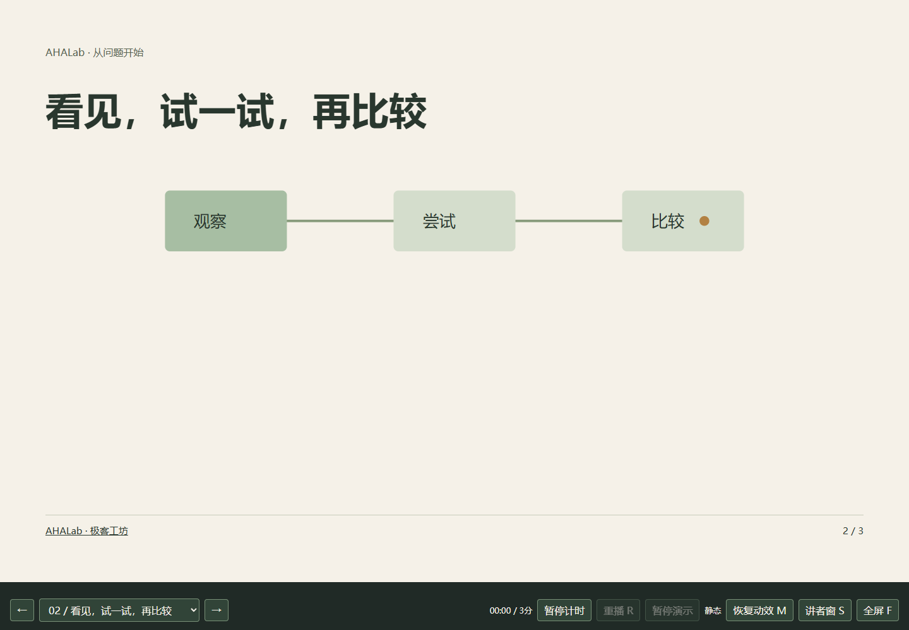
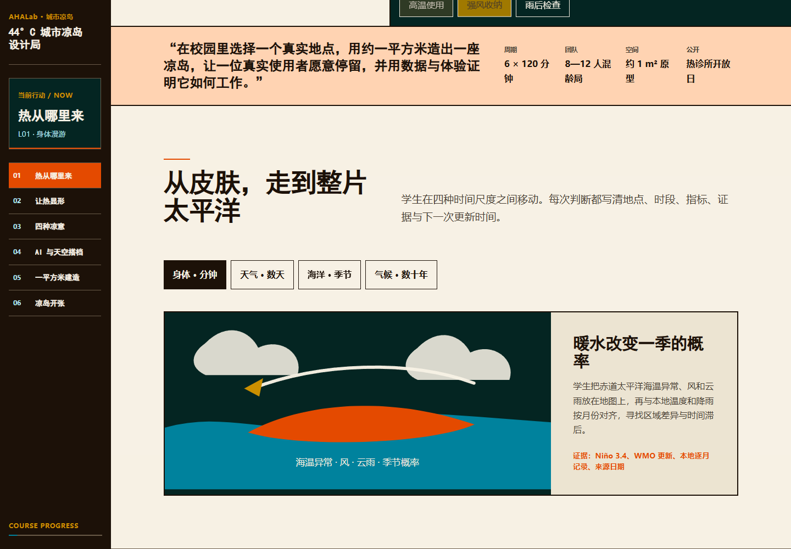

[](https://aha-lab.ai/)

# AHALab Open Course

课堂暖场工具：[AI-or-human](tools/warmup-ai-or-human/README.md) · 让学生先判断，再说出依据，并回到可复核的来源。

[](https://github.com/AHALabAI/open-course/stargazers)
[](https://github.com/AHALabAI/open-course/fork)
[](LICENSE.md)
[](LICENSE.md)

**重建 AI 时代的物理意义感。**

[课程网站](https://aha-lab.ai/) · [English](README.en.md) · [使用与署名](ATTRIBUTION.md)

这里整理 AHALab · 极客工坊的公开课程与可复用工具。课程围绕两条方向持续展开：与他人合作、关心他人；与真实世界建立联系，通过观察、研究和动手来理解问题。

## 选择一门课

| 主题 | 课程 | 形式与入口 |
|---|---|---|
| 与世界相连 | [MMCOOL：我们生活在同一个世界](courses/world-and-society/mmcool-worldview/README.md) | 两天各约 120 分钟；已整理第一天的官网课件、讲稿和活动入口 |
| 气候与生态 | [城市凉岛](courses/climate-and-ecology/cool-island/README.md) | 六节各约 120 分钟；教案和浏览器互动代码可在本机运行 |

每门课含对象与时长、课程说明、课次、活动、资料出处、配套代码及来源声明。跨主题课程只保存一份，用 [catalog.json](catalog.json) 与 course.json 中的多个主题标签检索。

## 直接使用工具

[HTML 课件播放器](tools/html-ppt-player/README.md)：含三页示例、独立讲者窗、讲稿、计时与过程演示。无需额外运行库。

```sh
cd tools/html-ppt-player
python serve.py --port 8827
```

打开 http://127.0.0.1:8827/ ，按 S 打开讲者窗。需要 Python 3.11+ 和现代浏览器。

## 看看实际效果

| HTML 课件与讲者窗 | 城市凉岛互动课程 |
|---|---|
| [](tools/html-ppt-player/README.md) | [](courses/climate-and-ecology/cool-island/README.md) |

## 找材料与参与改编

- 学习者：从课程 README 进入课次；联网内容会标明原站入口。
- 教师：查看 syllabus、assessment 和活动材料，再按实际课堂调整。
- 开发者：进入 tools 或课程 code 目录；按 [贡献说明](CONTRIBUTING.md) 提交修正。
- 课程作者：使用 [课程模板](templates/course/README.md)，维护 [目录约定](docs/repository-guide.md) 和来源。
- skills 作者：按 [技能包约定](skills/README.md) 单独注明指令、脚本与依赖的许可。

课程内容主要为简体中文，英文摘要用于检索；只在翻译完成后才列为该语言的完整课程。默认入口保持中文。

## 许可

AHALab 原创课程内容与说明采用 **CC BY 4.0**；软件代码采用 **MIT**。允许相应许可范围内的商业使用，保留作者、来源、许可与适用的修改说明。第三方材料、品牌和个人权利分别处理；不表示 AHALab 为采用者背书。详见 [LICENSE.md](LICENSE.md)。

## 维护

`courses/<主题>/<课程>/` 使用稳定路径；课程版本记在 course.json 与 CHANGELOG 中，用 Git 标签标记可复现版本。大体积影像和完整离线材料包在网站或发布附件中提供，仓库以可编辑代码与教学说明为主。

运行 `python scripts/check_catalog.py` 检查本地目录、来源和公开边界。[发布方法](docs/publishing.md) 说明网站与仓库如何分别更新。

## Fork、交流与贡献

[Fork 这个仓库](https://github.com/AHALabAI/open-course/fork)，从一门课或一个工具开始改编；请保留许可和来源，记录自己的修改。修正事实、补充活动或改进代码，可以通过 Pull Request 交流。问题与建议可提交到 [Issues](https://github.com/AHALabAI/open-course/issues)。

如果这些材料对你有帮助，可以 [Star](https://github.com/AHALabAI/open-course/stargazers) 关注更新。无需 Star 或 Fork 也能按许可证使用材料。

相关工具：[ZimaBlueAI / skills](https://github.com/ZimaBlueAI/skills)。
