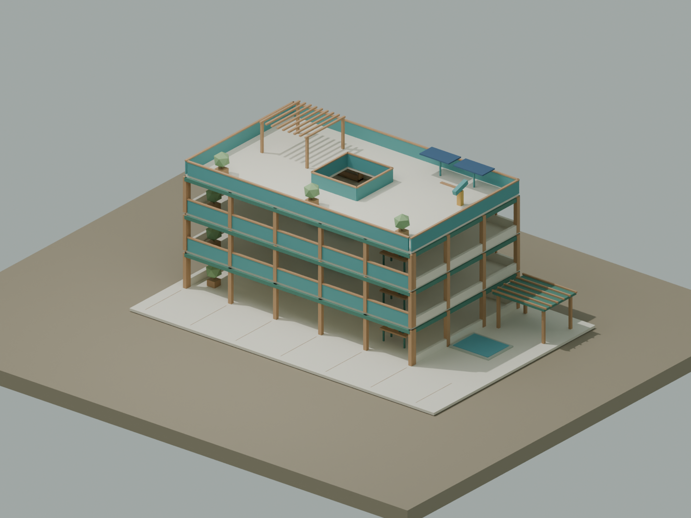

# 从空间到游戏：3D 创作与真实空间重建



从一个可以拾取的物体开始，逐步做出能探索、能合作的小世界；再用公开标定照片研究，怎样把真实空间转成可以检查和修改的三维模型。

[课程网站（16 种语言）](https://aha-lab.ai/course/ai-game-studio/#source-code) · [课程安排](syllabus.md) · [学习成果检查](assessment.md) · [下载 v0.1.0](https://github.com/AHALabAI/open-course/releases/tag/spatial-workflows-v0.1.0)

## 选择一个起点

| 课次 | 做什么 | 可编辑源码与使用说明 |
|---|---|---|
| [01 · 一间房，一个小任务](sessions/01-world-starter/README.md) | 拾取木头、点火、进入小游戏，理解模型、互动与任务的关系 | [world-starter](code/world-starter/README.md) |
| [02 · 四层探索工坊](sessions/02-explorer-workshop/README.md) | 探索楼层、建造、完成任务，尝试访客联机与可选 AI 伙伴 | [aha-world](code/aha-world/README.md) |
| [03 · 从照片到空间](sessions/03-space-reconstruction/README.md) | 公开标定照片、网格重建、局部修复、同相机对照与渲染 | [office-reconstruction](code/office-reconstruction/README.md) |

三份源码均直接包含在本课程的 `code/` 中，可随仓库克隆、浏览和修改。课程版对应 `spatial-workflows-v0.1.0`。每个示例保留自己的依赖锁文件、许可证及运行说明。

前两部分适合愿意使用终端、修改参数并反复试玩的学习者；无需先会三维建模，也不需要 AI API Key。第三部分适合有 Python 和文件路径使用经验的进阶学习者。可独立选择模块，教师可按准备程度调整节奏。

## 克隆并运行第一个示例

需要 Git、Node.js 22 或更高版本。Windows PowerShell：

```powershell
git clone https://github.com/AHALabAI/open-course.git
cd open-course/courses/spatial-world/spatial-workflows/code/world-starter
npm ci
Copy-Item .env.example .env.local
npm start
```

打开 http://127.0.0.1:8795 。macOS / Linux 将复制命令换成 `cp .env.example .env.local`。已有配置请保留；Key 留空即可体验本地规则。更换示例前先结束当前服务，再进入对应目录。

四层工坊使用相同安装步骤，入口为 http://127.0.0.1:8787 。公开空间重建面向 Windows，需要额外安装 Python、Blender、COLMAP/OpenMVS 与 FFmpeg；请从其 [完整操作手册](code/office-reconstruction/README.md) 开始。

## 建议的学习方式

每轮只改一件事：写清想让玩家或观察者体验什么，修改一个规则或一处几何，请另一人尝试，再记录证据。完成作品时一并说明「改了什么」「怎样验证」「还有什么不知道」。

第一个示例可研究：玩家怎样发现可拾取的物体？第二个可研究：楼层、任务与合作怎样互相影响？第三个可研究：修复后更完整的表面，有多少来自照片，有多少来自推断？

## 使用范围

- 本目录提供独立教学房间和原创四层工坊。[world.aha-lab.ai](https://world.aha-lab.ai/) 保留原游戏；原 AHA 空间模型和学生作品链接不包含在本课程中。
- 游戏默认本地运行，公开部署与多人安全边界见各示例 README。接入付费 AI 是可选项，真实密钥只能保存在本地配置中。
- 重建示例通过脚本获取公开数据，不包含完整照片集、私有实拍、原 AHA 模型或模型权重。修复坐标针对 office1a，并非任意房屋的一键重建器；新机器完整重建与渲染流程尚未全程复跑验证。
- 本仓库课程文档以中文为主；课程网站提供多语言阅读。软件界面及下载包的语言范围以各目录说明为准。

## 许可与来源

本课程的原创教案和学习活动采用 CC BY 4.0；`code/` 内的 AHALab 原创代码、程序化模型及随包文档按各目录 MIT LICENSE 使用。第三方库、数据和工具保留自身许可。详见 [署名说明](ATTRIBUTION.md) 和 [资源目录](resources.json)。

欢迎 Fork 和改编。请保留许可与来源，建议在作品说明中注明「基于 AHALab 公开课程」并链接 https://aha-lab.ai/ 。

## English overview

Three editable examples are included under `code/`: a small interactive room, a four-storey exploration workshop, and a Windows workflow for reconstructing the public office1a dataset. Start with a playable action, test one change at a time, and distinguish photographic evidence from inferred geometry. Teaching notes are in Chinese; the course website offers multilingual reading. See each example for setup, rights and limitations.
